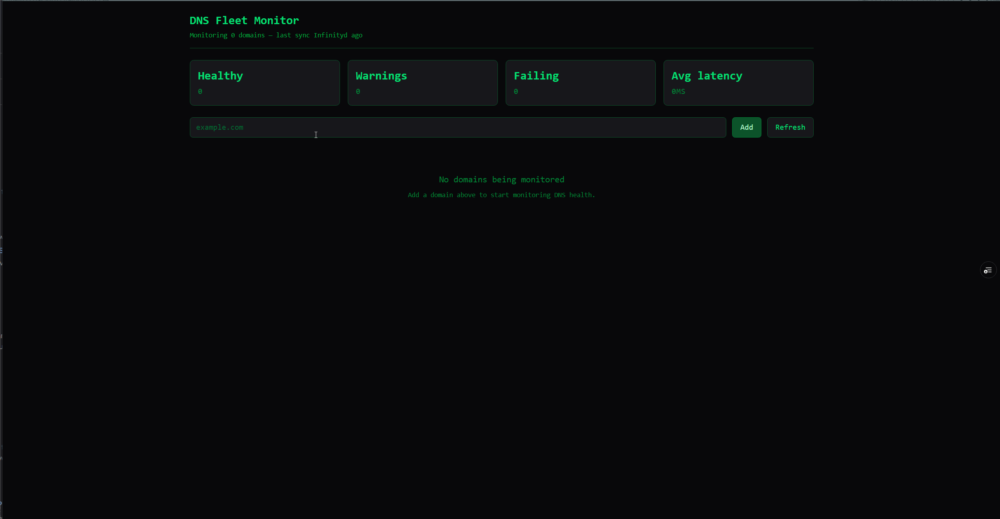

# DNS Fleet Monitor

A lightweight DNS monitoring dashboard for tracking the health of multiple domains in real time. Built with React and Tailwind CSS.

**[Live demo →](https://dns-fleet-monitor.vercel.app/)**



DNS Fleet Monitor checks A, MX, SPF, and DNSSEC records for each domain you add, measures DNS query latency, and refreshes automatically every 30 seconds. The domain list persists in localStorage so your fleet survives page reloads.

**DNSSEC-enabled test domains** (since most public sites don't sign their zones): `dustin.no`, `norid.no`, `regjeringen.no`

## Features

- Real-time DNS health monitoring for A, MX, SPF, and DNSSEC
- Four parallel DNS queries per domain via `Promise.all`
- Auto-refresh every 30 seconds, plus manual refresh
- Per-domain latency measurement
- Aggregated dashboard: healthy / warnings / failing / avg latency
- Persistent local storage with graceful corruption recovery
- Click-to-expand rows showing the actual record values
- Add and remove domains with input validation
- Minimal terminal-inspired UI, responsive down to mobile

## Tech Stack

- React 19 + Vite
- Tailwind CSS v4
- Google DNS-over-HTTPS API
- LocalStorage for persistence

## How It Works

Each domain runs four checks against Google's public DNS-over-HTTPS endpoint (`https://dns.google/resolve`):

| Check  | What it verifies |
|--------|------------------|
| A      | The domain resolves to one or more IPv4 addresses |
| MX     | Mail exchange records exist |
| SPF    | A valid SPF record is published in TXT |
| DNSSEC | The response is authenticated (AD flag set) |

Each domain is then assigned a rolled-up status:

```js
function getDomainStatus(domain) {
  const statuses = Object.values(domain.checks).map(c => c.status)
  if (statuses.includes("fail")) return "failing"
  if (statuses.includes("warning")) return "warning"
  if (statuses.includes("pending")) return "loading"
  return "healthy"
}
```

This follows the standard monitoring convention used by Datadog, Nagios, and PagerDuty: the worst status wins.

## Design Decisions

- **Lazy `useState` initializer for localStorage** — domains are read from localStorage on first mount without rendering seed data first. One-way data flow: localStorage → state once at boot, state → localStorage continuously thereafter.
- **Functional state updates in async code** — every state update inside a `.then()` uses `setDomains(prev => ...)` instead of referencing closure-captured state, which prevents race conditions when multiple DNS queries resolve out of order.
- **Parallel over sequential lookups** — `Promise.all` fires all four record-type queries simultaneously, giving sub-200ms refresh cycles per domain.
- **Custom `useNow()` hook** — "X seconds ago" timestamps update live without prop drilling. Each consumer gets its own ticker via a reusable hook.
- **Effect cleanup for timers** — the 30-second auto-refresh `setInterval` is created inside `useEffect` and torn down on unmount, preventing memory leaks and ghost timers.
- **Defensive coding throughout** — try/catch around `JSON.parse` for localStorage, divide-by-zero guard on average latency, input sanitization for added domains.

## Run Locally

```bash
git clone https://github.com/Clevert3ch/dns-fleet-monitor.git
cd dns-fleet-monitor
npm install
npm run dev
```

Then open `http://localhost:5173`.

## Project Structure

```
src/
├── components/
│   ├── AddDomainBar.jsx
│   ├── ExpandedDetail.jsx
│   ├── Header.jsx
│   ├── StatCard.jsx
│   ├── StatusDot.jsx
│   ├── Table.jsx
│   └── TableRow.jsx
├── utils/
│   ├── formatLastSync.js
│   └── useNow.js
├── App.jsx
├── main.jsx
└── index.css
```

## What I Learned

- **Component design with real criteria** — deciding what becomes a component based on whether it's reused, owns its own logic, or is complex enough that breaking it out improves readability. No more "this feels like a component" guessing.
- **Data-driven UI** — controlled inputs, derived values computed on every render, and functional state updates (`setDomains(prev => ...)`) to keep everything predictable and safe in async code.
- **Rendering vs. side effects** — API calls, timers, and localStorage writes belong in `useEffect`. Cleanup functions are non-negotiable when working with subscriptions or intervals — without them you get memory leaks and ghost timers.
- **My first custom hook** — packaging `useState` + `useEffect` into `useNow` keeps consuming components clean and demonstrates that hooks aren't magic, just functions that follow naming conventions.
- **Tailwind utility-first CSS** — responsive breakpoints, hover/focus states, and the discipline of writing full utility class names rather than constructing them dynamically (which breaks Tailwind's static analysis).

## Limitations

- localStorage is per-browser and per-device — your fleet doesn't sync across devices
- Google DoH has generous but real rate limits; very large fleets would need throttling

## Future Improvements

- Historical uptime and latency tracking with charts
- Notifications / webhooks on status changes
- Backend persistence and multi-user support
- Light theme toggle
- Export reports as CSV/JSON
